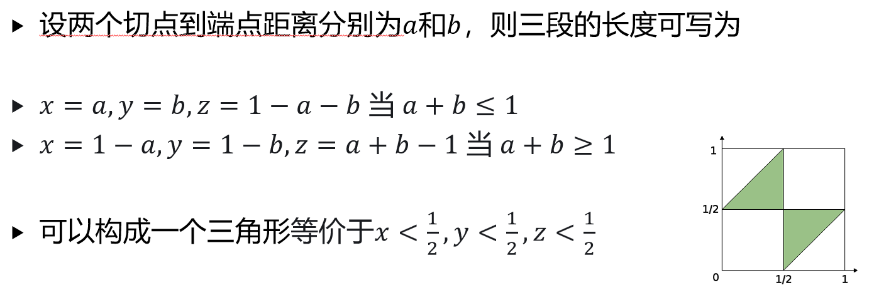

# 1. 课程介绍与概率论基础

第一部分先把概率论的语言搭起来。后面不管是随机变量、尾界还是统计推断，最底层都在反复用几件事，样本空间、事件运算、条件概率、独立性，以及 union bound 这种粗但是好用的估计。

## 课程信息

### 成绩评定

- 原始分为作业 $30\%$ ，期中考试 $35\%$ ，期末考试 $35\%$
- 期中考试覆盖前八周全部内容
- 期末考试覆盖全部内容，以后半学期为主
- 最终成绩会做保序的向上调分，即调分函数只和原始分有关，单调且不降低分数

### 作业

- 共九次作业，第 $0$ 次不提交，第 $8$ 次不批改但占 $2\%$
- 其余作业各占 $4\%$
- 可能会有 bonus 题
- 迟交一天扣该次作业成绩的 $20\%$
- 鼓励讨论，但不要抄袭

### 课程大纲

- 概率论的基本概念
- 随机变量及其分布
- 多维随机变量及其分布
- 尾不等式、大数定律与中心极限定理
- 参数估计
- 回归分析

这门课的概率部分会经常贴到信息科学例子上，比如 randomized algorithm、随机图、球桶模型、哈希、图形学里的 Monte Carlo。下面把具体题目穿插在对应知识点后面，复习时可以顺着概念直接看题。

## 随机事件和样本空间

随机现象是在相同条件下重复进行时，结果不总是相同的现象。随机试验就是可以在相同条件下重复的随机现象。

样本空间 $S$ 是所有可能基本结果的集合。样本点记作 $e$ ，事件就是样本空间的子集。

- 基本事件，只含一个样本点的事件
- 必然事件，样本空间 $S$
- 不可能事件，空集 $\emptyset$
- 事件发生，事件里的某个样本点出现

事件关系和集合关系一样。

- $A\subset B$ ，事件 $A$ 发生时事件 $B$ 也发生
- $A=B$ ，同时有 $A\subset B$ 和 $B\subset A$
- $A$ 与 $B$ 互不相容， $A\cap B=\emptyset$

事件运算也按集合运算理解。

- 并事件 $A\cup B$ ，至少一个发生
- 交事件 $A\cap B$ ，也写作 $AB$ ，同时发生
- 差事件 $A-B=A\cap \overline{B}$ ， $A$ 发生而 $B$ 不发生
- 对立事件 $\overline{A}=S-A$

常用运算律包括交换律、结合律、分配律和 De Morgan 公式

$$
\overline{A\cup B}=\overline{A}\cap \overline{B},\qquad
\overline{A\cap B}=\overline{A}\cup \overline{B}
$$

做题时先把文字翻译成事件，很多概率题其实会变成集合题。

## 频率、概率和概率模型

在 $n$ 次试验中，事件 $A$ 发生 $n_A$ 次，频率定义为

$$
f_n(A)=\frac{n_A}{n}
$$

频率满足非负性、规范性、有限可加性和单调性。概率可以先理解成频率在大量重复试验下趋于稳定的值。

概率也满足类似性质。

- 非负性， $0\leq P(A)\leq 1$
- 规范性， $P(S)=1$
- 有限可加性，若 $A_1,A_2,\ldots,A_n$ 两两互不相容，则

$$
P\left(\bigcup_{i=1}^{n}A_i\right)=\sum_{i=1}^{n}P(A_i)
$$

### 古典概型

古典概型有两个条件，样本点有限，且每个样本点等可能。此时

$$
P(A)=\frac{|A|}{|S|}
$$

计数时最重要的是先数清楚样本空间，再数事件对应的样本点。随机图、球桶、生日悖论都属于这一类。

先看随机图中固定 $k$ 个人两两认识。

有 $n$ 个人，每一对人等概率认识或不认识。所有关系共有 $\binom{n}{2}$ 条边，因此样本点数量为 $2^{\binom{n}{2}}$
若固定 $k$ 个人，他们两两认识需要 $\binom{k}{2}$ 条边全部出现，所以概率为 $2^{-\binom{k}{2}}$
两两均不认识同理，也是 $2^{-\binom{k}{2}}$
这类题不要先想图长什么样，先数“需要固定几条边”。

再看球桶模型与哈希冲突。

有 $n$ 个球，每个球等可能放进 $m$ 个桶。每个桶至多一个球的概率为

$$
P_{n,m}
=\frac{m(m-1)\cdots(m-n+1)}{m^n}
=\prod_{i=0}^{n-1}\left(1-\frac{i}{m}\right)
$$

使用 $\ln(1+x)\leq x$ 可以得到上界

$$
P_{n,m}\leq \exp\left(-\frac{n(n-1)}{2m}\right)
$$

课件还给出更精细的下界

$$
P_{n,m}\geq
\exp\left(-\frac{n(n-1)}{2m}\right)
\left(1-O\left(\frac{n^3}{m^2}\right)\right)
$$

所以为了让哈希表大概率没有冲突，需要桶数达到

$$
m=\Theta(n^2)
$$

生日悖论就是同一个估计的生活版， $23$ 个人中有两人同生日的概率已经超过 $50\%$ 。

### 渐进符号

- $f(n)=O(g(n))$ ，存在常数 $M$ ，使得充分大的 $n$ 都有 $f(n)\leq Mg(n)$
- $f(n)=\Omega(g(n))$ ，存在常数 $m$ ，使得充分大的 $n$ 都有 $f(n)\geq mg(n)$
- $f(n)=\Theta(g(n))$ ，同时满足 $O(g(n))$ 和 $\Omega(g(n))$

### 几何概型

几何概型里，样本空间是一个连续区域，概率由度量给出。若事件 $A$ 对应区域的度量为 $m(A)$ ，样本空间度量为 $m(S)$ ，则

$$
P(A)=\frac{m(A)}{m(S)}
$$

Monte Carlo 方法就是反过来利用随机采样做数值估计。

几何概型可以先看单位圆与 Monte Carlo。

在 $[-1,1]\times[-1,1]$ 中均匀取一点，落在单位圆中的概率为面积比

$$
\frac{\pi}{4}
$$

反过来，如果随机打很多点，就能用落入单位圆的比例估计 $\pi$ 。这就是 Monte Carlo 的基本味道。

木棍三角形也是同一类几何概型。

在长度为 $1$ 的木棍上随机取两个点，将木棍分为三段。三段能构成三角形等价于每段长度都小于 $1/2$ ，几何区域面积比为

$$
\frac{1}{4}
$$

这题重点不是背答案，而是把两个切点的位置画成平面区域。

## 概率的公理化

严格来说，并不是样本空间的所有子集都一定拿来当事件。事件域 $F$ 是一族事件集合，它至少满足

- $S\in F$
- 若 $A\in F$ ，则 $\overline{A}\in F$
- 若 $A_i\in F$ ，则 $\bigcup_{i=1}^{+\infty}A_i\in F$

这样的 $F$ 称为事件域，也叫 $\sigma$ -代数。概率空间写作 $(S,F,P)$ ，其中概率函数 $P$ 满足

- 对任意 $A\in F$ ，有 $P(A)\geq 0$
- $P(S)=1$
- 对两两互不相容的 $A_1,A_2,\ldots$ ，有

$$
P\left(\bigcup_{i=1}^{+\infty}A_i\right)
=\sum_{i=1}^{+\infty}P(A_i)
$$

从公理可以推出常用性质。

- $P(\emptyset)=0$
- $P(\overline{A})=1-P(A)$
- 若 $A\subset B$ ，则 $P(A)\leq P(B)$
- $P(A-B)=P(A)-P(AB)$
- $P(A\cup B)=P(A)+P(B)-P(AB)$

一般加法公式就是容斥原理。

容斥可以用固定点问题练一遍。

$n$ 个有编号球随机排列，问至少有一个球位置不变的概率。令 $A_i$ 表示第 $i$ 个球位置不变，则用容斥

$$
P(A_1\cup\cdots\cup A_n)
=1-\frac{1}{2!}+\frac{1}{3!}-\frac{1}{4!}+\cdots
$$

固定点问题用容斥算起来比较规整。

### Union Bound

Union Bound 是这门课里很常用的粗估计。对任意事件 $A_1,\ldots,A_n$ ，不要求互不相容，都有

$$
P\left(\bigcup_{i=1}^{n}A_i\right)
\leq \sum_{i=1}^{n}P(A_i)
$$

它常用来估计算法失败概率。非常重要，会反复使用。

Union bound 估计球桶无冲突时很顺手。

令 $A_{ij}$ 表示第 $i$ 个球和第 $j$ 个球进入同一个桶，则

$$
P\left(\bigcup_{i \lt j}A_{ij}\right)
\leq \binom{n}{2}\frac{1}{m}
$$

于是无冲突概率有简单下界

$$
P_{n,m}\geq 1-\frac{n(n-1)}{2m}
$$

这个界比前面的精细估计粗，但推起来非常快。

另一个常用套路是概率证法，如果能证明某个事件 $A$ 满足 $P(A) \gt 0$ ，那么 $A$ 一定非空。这可以用来证明某种结构存在。

## 条件概率

若 $P(B) \gt 0$ ，在事件 $B$ 已经发生的条件下，事件 $A$ 发生的概率为

$$
P(A\mid B)=\frac{P(AB)}{P(B)}
$$

条件概率本身也满足概率的三条公理。直觉上，它只是把样本空间从 $S$ 缩小到了 $B$ 。

乘法公式为

$$
P(AB)=P(A\mid B)P(B)=P(B\mid A)P(A)
$$

推广到多个事件

$$
P(A_1A_2\cdots A_n)
=P(A_1)P(A_2\mid A_1)\cdots
P(A_n\mid A_1A_2\cdots A_{n-1})
$$

全概率公式，若 $B_1,\ldots,B_n$ 是 $S$ 的一个划分，且 $P(B_i) \gt 0$ ，则

$$
P(A)=\sum_{i=1}^{n}P(B_i)P(A\mid B_i)
$$

Bayes 公式为

$$
P(A\mid B)=P(B\mid A)\frac{P(A)}{P(B)}
$$

Bayes 公式用癌症检测会比较直观。

某病发病率为百万分之一，检测试剂准确率为 $99.9\%$ 。若检测结果为阳性，真正患病的概率并不是 $99.9\%$ 。

令 $A$ 表示患病， $B$ 表示检测结果为阳性，则 $P(A)=10^{-6}$

$$
P(B)=10^{-6}\cdot 0.999+(1-10^{-6})\cdot 0.001
$$

所以

$$
P(A\mid B)=0.999\cdot \frac{P(A)}{P(B)}
\approx \frac{1}{1001}
$$

低先验概率会强烈影响后验概率，这里不能只盯着检测准确率。

条件概率也有全概率公式。若 $B_1,\ldots,B_n$ 是划分，且 $P(C) \gt 0$ ，则

$$
P(A\mid C)
=\sum_{i=1}^{n}P(B_i\mid C)P(A\mid B_iC)
$$

## 事件的独立性

若

$$
P(AB)=P(A)P(B)
$$

则称事件 $A$ 与 $B$ 相互独立。若 $P(B) \gt 0$ ，这等价于

$$
P(A\mid B)=P(A)
$$

互不相容和独立不要混。若 $A$ 与 $B$ 互不相容且 $P(A),P(B) \gt 0$ ，那么 $P(AB)=0$ ，它们反而不独立。

三个事件 $A,B,C$ 两两独立是指

$$
P(AB)=P(A)P(B),\quad
P(AC)=P(A)P(C),\quad
P(BC)=P(B)P(C)
$$

三个事件相互独立还要额外满足

$$
P(ABC)=P(A)P(B)P(C)
$$

对 $n$ 个事件 $A_1,\ldots,A_n$ ，相互独立要求任意子集 $I\subseteq \lbrace 1,\ldots,n\rbrace$ 都满足

$$
P\left(\bigcap_{i\in I}A_i\right)
=\prod_{i\in I}P(A_i)
$$

相互独立推出 $A\cup B$ 与 $C$ 独立，可以直接按定义算。

若 $A,B,C$ 相互独立，则

$$
P((A\cup B)C)
=P(AC)+P(BC)-P(ABC)
$$

由相互独立性得

$$
P((A\cup B)C)
=P(A)P(C)+P(B)P(C)-P(A)P(B)P(C)
$$

整理为

$$
P((A\cup B)C)=P(A\cup B)P(C)
$$

所以 $A\cup B$ 与 $C$ 独立。

轮流射击可以直接列级数。

甲先射击，甲命中概率为 $p_1$ ，乙命中概率为 $p_2$ ，先命中者获胜。甲获胜概率为 $p_1+(1-p_1)(1-p_2)p_1+(1-p_1)^2(1-p_2)^2p_1+\cdots$
这是一个等比级数，因此

$$
P(\text{甲胜})
=\frac{p_1}{1-(1-p_1)(1-p_2)}
$$

乙获胜概率可以用 $1-P(\text{甲胜})$ ，也可以从乙第一次出手机会开始列级数。

独立重复试验也是从这里来的。若某个随机试验只有两个结果 $A$ 和 $\overline{A}$ ，且每次独立重复，称为 $n$ 重 Bernoulli 试验。
