# 4. 多维离散随机变量

多维随机变量的麻烦不在“多了几个变量”，而在变量之间可能有关系。联合分布、边际分布、条件分布、独立性、协方差，这几组词要分清楚。具体题目就跟在对应知识点后面看，不然容易只记公式不记用法。

## 多维随机变量的定义

给定同一个样本空间 $S$ ，若 $X_1(e),X_2(e),\ldots,X_n(e)$
都是定义在 $S$ 上的随机变量，则 $X(e)=(X_1(e),X_2(e),\ldots,X_n(e))$
称为 $n$ 维随机变量，也叫随机向量。若每个 $X_i$ 都是离散随机变量，则称为 $n$ 维离散随机变量。

## 联合分布、边际分布和条件分布

考虑二维离散随机变量 $(X,Y)$ 。若 $X$ 的可能取值为 $x_1,x_2,\ldots$ ， $Y$ 的可能取值为 $y_1,y_2,\ldots$ ，定义联合分布列

$$
p_{ij}=P(X=x_i,Y=y_j)
$$

它满足

$$
p_{ij}\geq 0,\qquad
\sum_i\sum_j p_{ij}=1
$$

由联合分布列可以求边际分布列

$$
P(X=x_i)=\sum_j P(X=x_i,Y=y_j)
$$

$$
P(Y=y_j)=\sum_i P(X=x_i,Y=y_j)
$$

若 $P(Y=y_j)>0$ ，则给定 $Y=y_j$ 时 $X$ 的条件分布列为

$$
P(X=x_i\mid Y=y_j)
=\frac{P(X=x_i,Y=y_j)}{P(Y=y_j)}
$$

若 $P(X=x_i)>0$ ，则给定 $X=x_i$ 时 $Y$ 的条件分布列为

$$
P(Y=y_j\mid X=x_i)
=\frac{P(X=x_i,Y=y_j)}{P(X=x_i)}
$$

这三个东西的关系要记清楚，联合分布是全表，边际分布是按行或按列求和，条件分布是先固定一个变量再归一化。

联合分布表可以先用一个小模型练手。

随机变量 $X$ 等概率取 $\{1,2,3,4\}$ 中的一个，给定 $X$ 后，随机变量 $Y$ 等概率取 $\{1,\ldots,X\}$ 中的一个。

联合分布为

$$
P(X=x,Y=y)=
\begin{cases}
\dfrac{1}{4x}, & 1\leq y\leq x,\ x\in\{1,2,3,4\}, \\
0, & \text{其他}.
\end{cases}
$$

边际分布通过对联合分布求和得到。比如

$$
P(Y=1)=\frac{1}{4}+\frac{1}{8}+\frac{1}{12}+\frac{1}{16}
$$

这题按“先写联合，再求边际，再求条件”的顺序走就行。

再看两次通讯成功。

每次通讯成功概率为 $p$ ，重复通讯直到成功两次。 $X$ 表示第一次成功的通讯次数， $Y$ 表示第二次成功的通讯次数。若 $1\leq m<n$ ，则

$$
P(X=m,Y=n)=p^2(1-p)^{n-2}
$$

边际分布为

$$
P(X=m)=p(1-p)^{m-1}
$$

$$
P(Y=n)=p^2(1-p)^{n-2}(n-1)
$$

给定 $Y=n$ 时，第一次成功可能在 $1,\ldots,n-1$ 中任意一次，所以

$$
P(X=m\mid Y=n)=\frac{1}{n-1}
$$

## 多维离散随机变量的独立性

二维随机变量 $X,Y$ 相互独立，是指对任意 $x,y$ 都有

$$
P(X=x,Y=y)=P(X=x)P(Y=y)
$$

判断独立性时，最好直接找一个反例。只要存在一对取值让等式不成立，就不独立。

对 $n$ 维随机变量， $X_1,\ldots,X_n$ 相互独立要求

$$
P(X_1=x_1,\ldots,X_n=x_n)
=\prod_{i=1}^{n}P(X_i=x_i)
$$

注意它与事件相互独立的不同表示。随机变量独立是对所有取值都写等式。

相互独立一定推出两两独立，反过来不一定。常见反例是 $X_3=X_1\oplus X_2$
其中 $X_1,X_2$ 独立均匀取 $0,1$ ，则 $X_1,X_2,X_3$ 两两独立但不相互独立。

若 $X_1,\ldots,X_n$ 相互独立且同分布，称为独立同分布，记作 i.i.d.

二项分布和负二项分布可以这样拆

$$
Y\sim B(n,p)
\quad\Longleftrightarrow\quad
Y=X_1+\cdots+X_n,\quad X_i\sim B(1,p)
$$

$$
Y\sim NB(r,p)
\quad\Longleftrightarrow\quad
Y=X_1+\cdots+X_r,\quad X_i\sim G(p)
$$

独立性判断最好直接找反例。

球桶模型中， $X_i$ 表示第 $i$ 个桶中的球数，则 $X_i$ 和 $X_j$ 一般不独立，因为一个球进了第 $i$ 个桶，就会影响它进入第 $j$ 个桶的可能性。

随机图模型中， $X_i$ 表示第 $i$ 个人认识的人数， $X_i$ 和 $X_j$ 一般也不独立，因为它们共享边 $\{i,j\}$ 。

判断不独立时，通常找一组取值使得

$$
P(X=x,Y=y)\neq P(X=x)P(Y=y)
$$

条件独立的条件很苛刻，举反例时可以构造使 $P(X=x,Y=y)=0$ 但 $P(X=x),P(Y=y)\neq 0$ 的反例。

下面是两道独立性题目的截图。

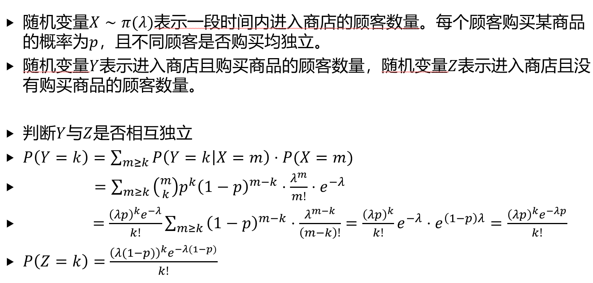

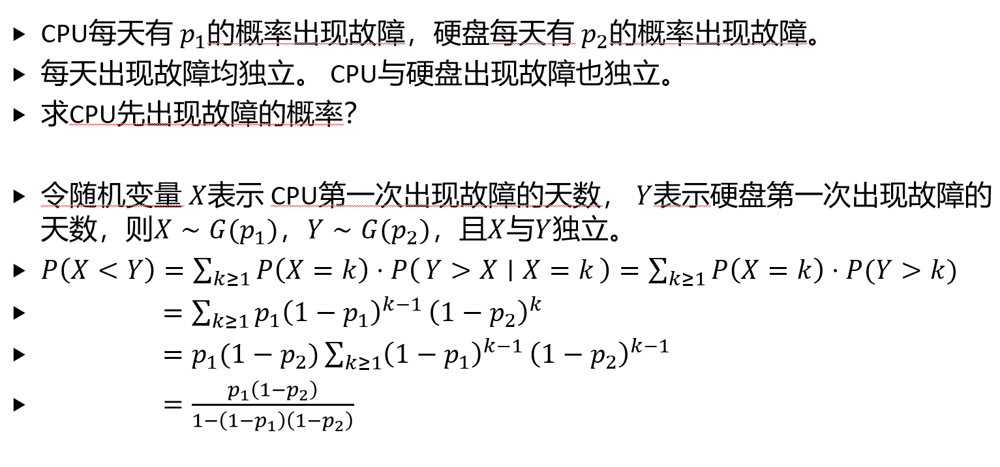

Poisson thinning 的结论很干净。

设 $X\sim \pi(\lambda)$ 表示一段时间内进入商店的顾客数。每个顾客以概率 $p$ 购买商品，令 $Y$ 为购买人数， $Z$ 为未购买人数。

则

$$
Y\sim \pi(\lambda p),\qquad
Z\sim \pi(\lambda(1-p))
$$

并且 $Y$ 与 $Z$ 相互独立。证明时直接算边际和联合

$$
P(Y=k)=\sum_{m\geq k}P(Y=k\mid X=m)P(X=m)
$$

最后得到

$$
P(Y=k)=\frac{(\lambda p)^k}{k!}e^{-\lambda p}
$$

同理可以得到 $Z$ 的分布，再算

$$
P(Y=k,Z=l)=P(Y=k)P(Z=l)
$$

CPU 与硬盘首次故障可以用几何分布来算。

若 CPU 每天故障概率为 $p_1$ ，硬盘每天故障概率为 $p_2$ ，并且各天、各设备之间独立。令 $X\sim G(p_1),\qquad Y\sim G(p_2)$
分别表示 CPU 和硬盘第一次故障的天数，则 CPU 先故障的概率为

$$
P(X<Y)=\sum_{k\geq 1}P(X=k)P(Y>k)
$$

代入几何分布得到

$$
P(X<Y)
=\frac{p_1(1-p_2)}{1-(1-p_1)(1-p_2)}
$$

## 多维随机变量的特征数

若 $Z=g(X,Y)$ ，则

$$
E(Z)=\sum_i\sum_j P(X=x_i,Y=y_j)g(x_i,y_j)
$$

期望有线性性，而且不需要独立性

$$
E(X+Y)=E(X)+E(Y)
$$

更一般地

$$
E(X_1+\cdots+X_n)=E(X_1)+\cdots+E(X_n)
$$

这个性质做计数题很方便。设 $X=\sum_i \mathbf{1}_{A_i}$ ，则

$$
E(X)=\sum_i P(A_i)
$$

用示性函数算期望时，拆开会比硬数简单。

有 $m$ 对认识的人随机分到两组，被分开的认识对数期望为

$$
\frac{m}{2}
$$

$n$ 个有编号球随机排列，位置不变的球数期望为

$$
1
$$

$n$ 个球有放回地取 $m$ 次，取到的不同编号数量期望为

$$
n\left(1-\left(1-\frac{1}{n}\right)^m\right)
$$

这些题都不是靠硬数，而是写成示性函数之和。

Coupon Collector 是示性函数求期望的经典用法。

有 $n$ 个有编号的球，每次等概率随机取一个，直到所有球至少被取到过一次。令 $X_i$ 表示已经取到 $i-1$ 种球后，再取到新球需要的次数，则

$$
X_i\sim G\left(\frac{n-i+1}{n}\right)
$$

所以

$$
E(X)=\sum_{i=1}^{n}E(X_i)
=n\sum_{i=1}^{n}\frac{1}{i}
=\Theta(n\log n)
$$

这里有一个参数容易写成 $n-i$ ，正确的是 $n-i+1$ 。

若离散随机变量 $X,Y$ 相互独立，则 $E(XY)=E(X)E(Y)$
反过来不一定成立。若 $X_1,\ldots,X_n$ 相互独立，则 $E(X_1X_2\cdots X_n)=E(X_1)E(X_2)\cdots E(X_n)$
若 $X,Y$ 独立，则

$$
\operatorname{Var}(X\pm Y)
=\operatorname{Var}(X)+\operatorname{Var}(Y)
$$

推广到相互独立的 $X_1,\ldots,X_n$ ，有

$$
\operatorname{Var}(X_1\pm X_2\pm\cdots\pm X_n)
=\sum_{i=1}^{n}\operatorname{Var}(X_i)
$$

负二项分布的二阶矩可以用拆和的方式算。

若

$$
Y=X_1+\cdots+X_r,\qquad X_i\sim G(p)
$$

且 $X_i$ 相互独立，则

$$
E(Y)=\frac{r}{p}
$$

二阶矩展开为

$$
E(Y^2)=\sum_i\sum_j E(X_iX_j)
$$

其中

$$
E(X_i^2)=\frac{2-p}{p^2}
$$

$$
E(X_iX_j)=E(X_i)E(X_j)=\frac{1}{p^2},\qquad i\neq j
$$

所以

$$
E(Y^2)=\frac{r^2+r-rp}{p^2}
$$

并得到

$$
\operatorname{Var}(Y)=\frac{r(1-p)}{p^2}
$$

## 协方差

协方差用来度量两个随机变量的线性相关方向。定义为

$$
\operatorname{Cov}(X,Y)
=E((X-E(X))(Y-E(Y)))
=E(XY)-E(X)E(Y)
$$

性质

$$
\operatorname{Cov}(X,X)=\operatorname{Var}(X)
$$

$$
\operatorname{Cov}(X,Y)=\operatorname{Cov}(Y,X)
$$

$$
\operatorname{Cov}(aX,bY)=ab\,\operatorname{Cov}(X,Y)
$$

$$
\operatorname{Cov}(X_1+X_2,Y)
=\operatorname{Cov}(X_1,Y)+\operatorname{Cov}(X_2,Y)
$$

若 $X,Y$ 独立，则 $\operatorname{Cov}(X,Y)=0$ 。反过来不一定成立。

对和的方差，有

$$
\operatorname{Var}(X_1+\cdots+X_n)
=\sum_i\sum_j \operatorname{Cov}(X_i,X_j)
$$

也就是

$$
\operatorname{Var}(X_1+\cdots+X_n)
=\sum_i\operatorname{Var}(X_i)
+2\sum_{i<j}\operatorname{Cov}(X_i,X_j)
$$

特别地

$$
\operatorname{Var}(X+Y)
=\operatorname{Var}(X)+\operatorname{Var}(Y)+2\operatorname{Cov}(X,Y)
$$

随机图度数的协方差能看出“共享边”的影响。

随机图模型中，令 $X_i$ 表示第 $i$ 个人认识的人数。若 $i\neq j$ ，则

$$
\operatorname{Cov}(X_i,X_j)=\frac{1}{4}
$$

原因是两个人的度数都包含同一条边 $\{i,j\}$ ，这条边带来了正相关。

下面几张图是协方差和期望相关的题，属于当时标出来的巧妙题。

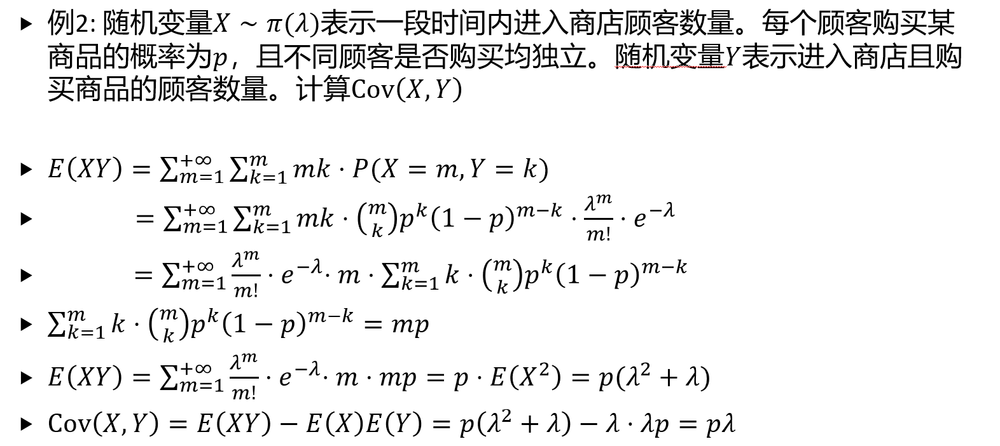

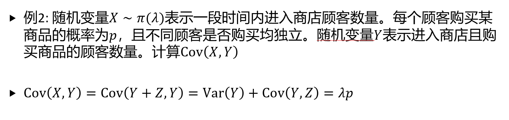

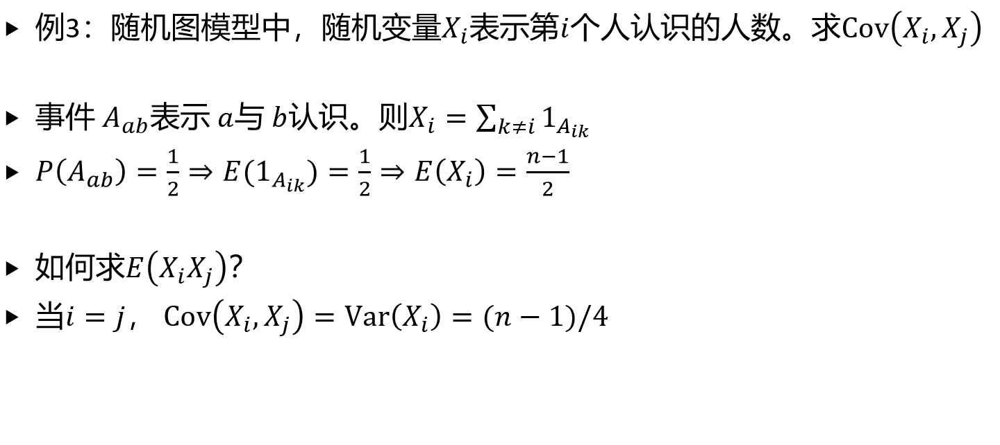

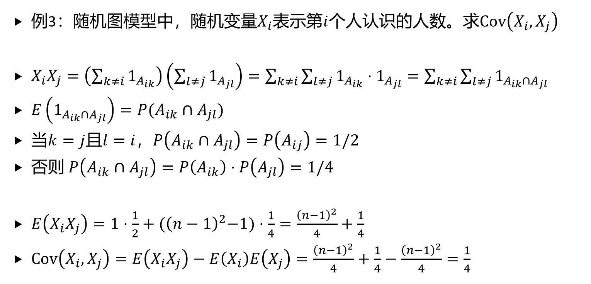

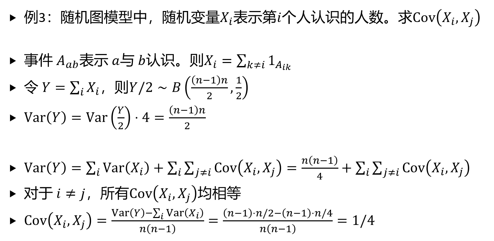

## 条件数学期望

给定 $Y=y_j$ ，条件期望定义为

$$
E(X\mid Y=y_j)
=\sum_i x_iP(X=x_i\mid Y=y_j)
$$

它就是条件分布下的数学期望，因此仍然满足线性性

$$
E(aX_1+bX_2\mid Y=y)
=aE(X_1\mid Y=y)+bE(X_2\mid Y=y)
$$

也可以对事件取条件。若 $P(E)>0$ ，则

$$
P(X=x_i\mid E)
=\frac{P(\{X=x_i\}\cap E)}{P(E)}
$$

对应条件期望为

$$
E(X\mid E)=\sum_i x_iP(X=x_i\mid E)
$$

若把 $E(X\mid Y=y)$ 记作 $g(y)$ ，则

$$
E(X\mid Y)=g(Y)
$$

这是一个新的随机变量。

重期望公式为

$$
E(E(X\mid Y))=E(X)
$$

用条件期望时，经常是先在条件下把问题变简单，再对条件本身取期望。

重期望可以先从购买人数这题看。

设 $X\sim \pi(\lambda)$ 表示顾客总数，每个顾客购买概率为 $p$ ， $Y$ 表示购买人数。给定 $X=x$ 时

$$
E(Y\mid X=x)=px
$$

于是

$$
E(Y)=E(E(Y\mid X))=pE(X)=\lambda p
$$

这比先求 $Y$ 的分布再算期望省很多。

Wald 型公式可以用“先给定次数再取期望”的方式理解。

若 $X_1,X_2,\ldots$ 独立同分布， $N$ 取正整数且与这列随机变量独立，则

$$
E\left(\sum_{i\leq N}X_i\right)=E(X_1)E(N)
$$

证明思路是先给定 $N=n$ ，此时

$$
E\left(\sum_{i\leq N}X_i\mid N=n\right)=nE(X_1)
$$

再对 $N$ 取期望。

下面保留原笔记中关于重期望的几张题图。

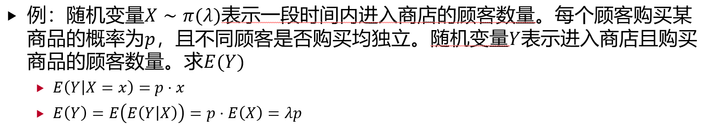

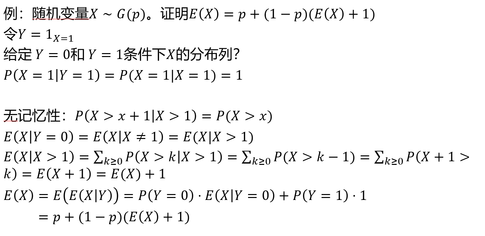

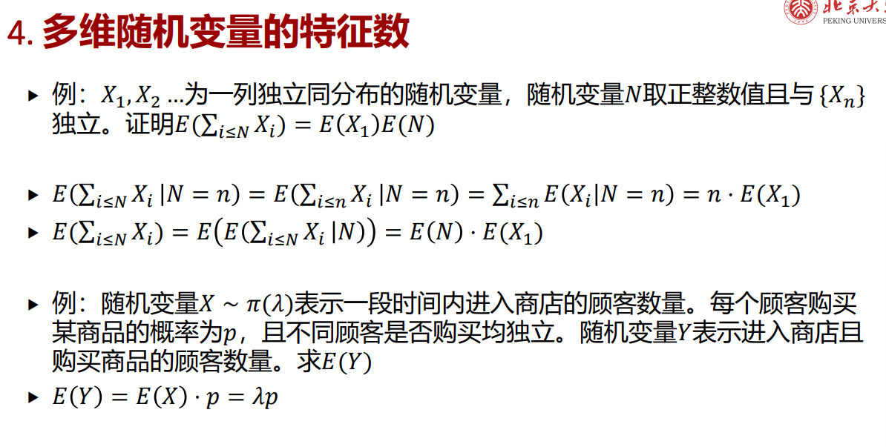

## 多维随机变量函数的分布

给定离散随机变量 $X,Y$ 和函数 $g(x,y)$ ，要求 $Z=g(X,Y)$
的分布列，直接枚举联合分布列即可，对所有可能的 $(x_i,y_j)$ ，计算 $g(x_i,y_j)$ ，再把相同结果的概率相加。

若 $X\sim B(n,p)$ ， $Y\sim B(m,p)$ ，且 $X,Y$ 独立，则 $X+Y\sim B(n+m,p)$
更一般地，若 $X_i\sim B(n_i,p)$ 相互独立，则

$$
\sum_i X_i\sim B\left(\sum_i n_i,p\right)
$$

若 $X\sim \pi(\lambda_1)$ ， $Y\sim \pi(\lambda_2)$ ，且 $X,Y$ 独立，则

$$
X+Y\sim \pi(\lambda_1+\lambda_2)
$$

更一般地，若 $X_i\sim \pi(\lambda_i)$ 相互独立，则

$$
\sum_i X_i\sim \pi\left(\sum_i \lambda_i\right)
$$

这两个结论都可以看成“同族分布在独立求和下封闭”。

随机变量函数的分布列还是先映射、再合并。

对所有可能的 $(x_i,y_j)$ ，列出

$$
P(X=x_i,Y=y_j)
$$

和

$$
g(x_i,y_j)
$$

然后把相同取值的概率合并。原笔记中的题图如下。

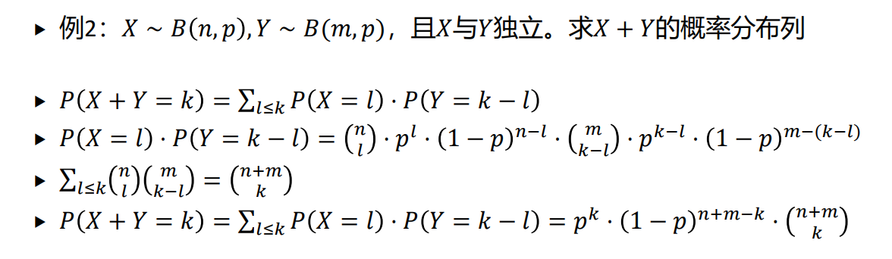

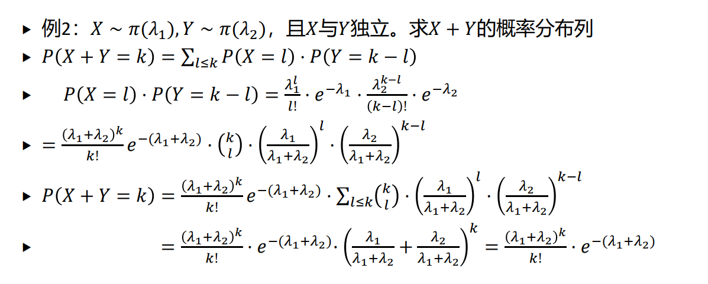

二项分布相加可以直接从生成函数看。

若 $X\sim B(n,p)$ ， $Y\sim B(m,p)$ ，且 $X,Y$ 独立，则

$$
P(X+Y=k)
=\sum_{l\leq k}P(X=l)P(Y=k-l)
$$

用 Vandermonde 恒等式

$$
\sum_{l\leq k}\binom{n}{l}\binom{m}{k-l}
=\binom{n+m}{k}
$$

得到

$$
X+Y\sim B(n+m,p)
$$

Poisson 分布相加也一样。

若 $X\sim \pi(\lambda_1)$ ， $Y\sim \pi(\lambda_2)$ ，且 $X,Y$ 独立，则

$$
P(X+Y=k)=\sum_{l\leq k}P(X=l)P(Y=k-l)
$$

整理后得到

$$
X+Y\sim \pi(\lambda_1+\lambda_2)
$$

Poisson 和二项分布类似，独立求和后仍留在同一个分布族里。
